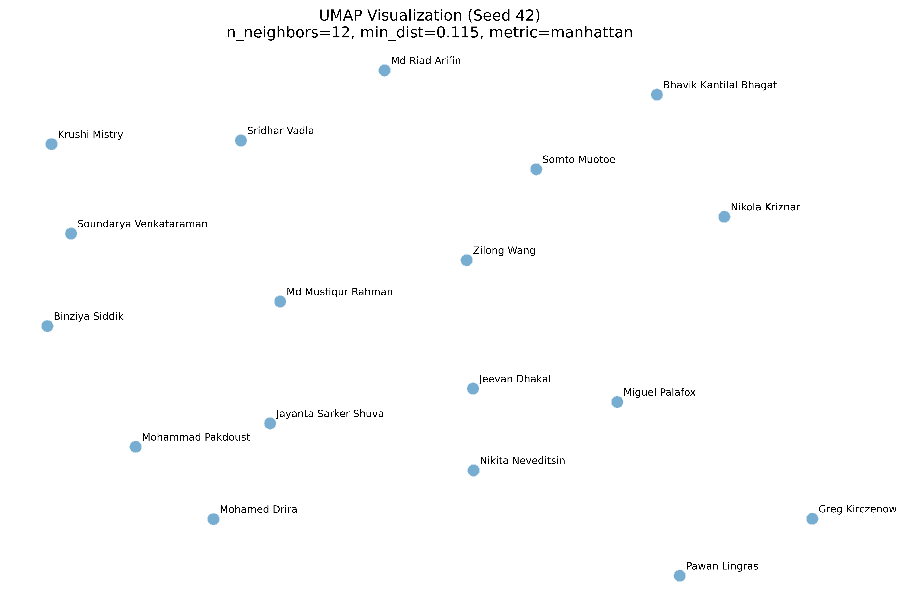
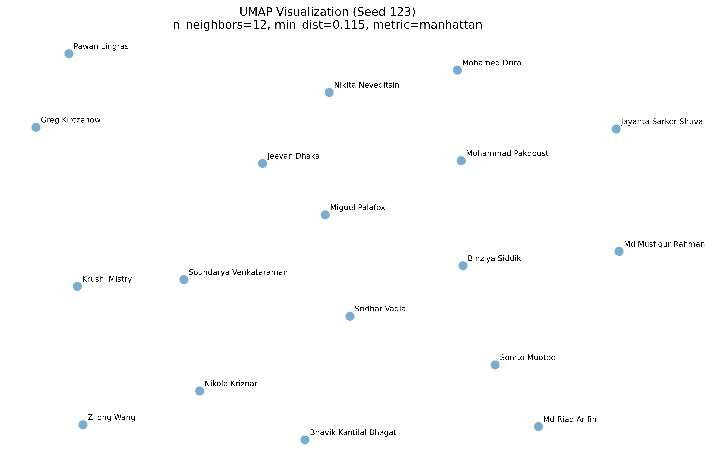
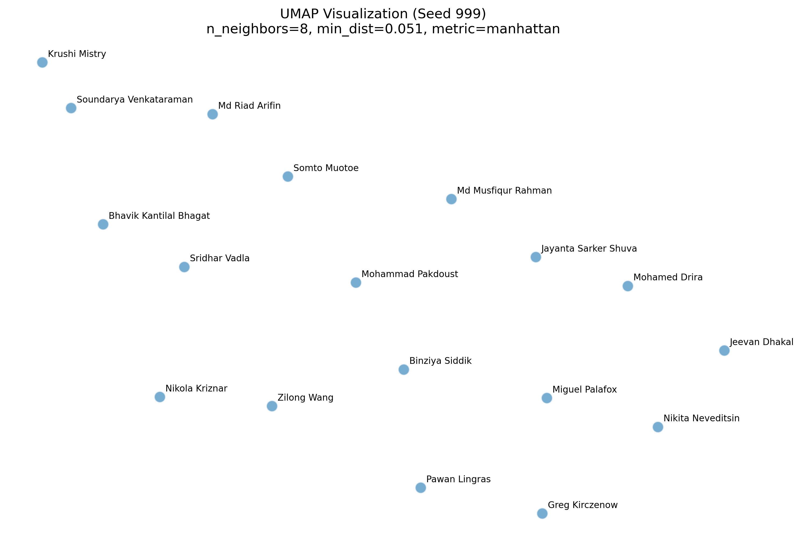

# MCDA5511 - Assignment1 - Sentence Embeddings

This visualization shows the similarity between classmates based on their stated written interests.  
Each point represents a student, and the distance between points reflects how similar their interests are. These positions are based on sentence embeddings generated using the all-MiniLM-L6-v2 model and then reduced to two dimensions using UMAP for visualization.

Students with similar interests appear closer together, while those with different interests appear farther apart.

## Generated Visualization


## How to run this project

```bash
uv sync
uv run python main.py
```

## What Are Embeddings?
### By: Miguel Angel Palafox Gomez

Mathematical models need numbers to perform calculations, not letters or words. Because of this, words and sentences must be transformed into numerical representations so that algorithms can process them and perform tasks such as clustering, classification, or similarity detection. 

These numerical representations are called embeddings. However, these numbers cannot simply be random. They must preserve meaning so that the relationships between words and sentences are reflected accurately. Embeddings are generated by deep learning models that learn patterns from large amounts of text and assign numbers in a meaningful way. These models learn which words and sentences tend to appear in similar contexts and use that information to create representations that capture meaning.  

A well-known example of word embeddings illustrates how meaning can be preserved through numerical relationships. If we take the embedding for the word “king”, subtract the embedding for “male”, and then add the embedding for “female”, the result is numerically close to the embedding for “queen”. This shows that embeddings capture relationships such as gender and roles, not just the spelling of words. In this way, embeddings allow mathematical models to reason about language in a way that reflects real-world meaning and associations.  

Sentence embeddings work in a similar way but operate on entire sentences rather than individual words. Instead of representing a single word, the model analyzes the overall meaning of a sentence and assigns a numerical representation that reflects its themes and context. For example, a student who writes “I enjoy gaming and playing cricket and volleyball” may be placed near someone who mentions sports or other recreational activities, even if they use different wording. Likewise, someone who says “I like to watch movies, reading detective novels and listening music” might appear close to another student who enjoys reading books, hiking, and watching documentaries because both descriptions reflect leisure activities such as reading and entertainment. Even though the exact words differ, the underlying interests are similar, and embeddings capture that similarity. By converting language into meaningful numerical form, embeddings make it possible for algorithms to compare, group, and visualize text based on meaning rather than exact wording. This allows models to identify patterns and relationships across large collections of text. 

The following figure illustrates a simple three-dimensional example of embeddings. In this illustrative representation, one dimension can be interpreted as a royalty-related attribute, another as a gender-related attribute, and the third as an additional contextual dimension. The embeddings (coordinates) shown are illustrative and were created for explanatory purposes to help visualize how embeddings can represent semantic relationships and analogies, such as how the relationship between king and queen reflects the relationship between male and female.


---


## Data Analysis Experiments
#### By: Bhavik Kantilal Bhagat

The changes made in the classmates.csv file are as follows.

| Name | Major Change? | Original Description | New Description | Impact |
| --- | --- | --- | --- | --- |
| Greg Kirczenow | No | "Swim, bike, run" | "swimming, cycling, running" | 0.873410 |
| Mohammad Pakdoust | Yes | "I am passionate about outdoor activities like hiking and camping, and I also enjoy movies and video games." | "I prefer to stay indoors, and I also do not like to watch movies or play video games." | 0.561741 |
| Bhavik Kantilal Bhagat | No | "Chess, Maths and Music." | "I enjoy playing chess, solving math puzzles, and listening to music." | 0.727488 |

### Impact of Changes

#### 1. Minor Changes (Synonyms) → High Similarity

When you replace a word like "enjoy" with "like," or rephrase with synonyms, the model produces a **high similarity score** (often 0.70 to 0.90) because:

- **Shared Context**: During training on millions of sentences, words like "enjoy" and "like" appear in almost identical environments (e.g., "I ____ trail running")
- **Vector Proximity**: Because these words are interchangeable in most contexts, the model places them very close together in the high-dimensional embedding space
- **Small Angle**: Cosine similarity measures the angle between two vectors. Since synonyms point in almost the same direction, the cosine of the angle is close to 1.0

**Example**: Greg's change from "Swim, bike, run" to "swimming, cycling, running" resulted in **0.873** similarity - very high because the core activities remain identical.

#### 2. Major Changes (Antonyms/Opposite Meaning) → Lower Similarity

Antonyms or opposite meanings result in **lower scores** (often 0.40 to 0.70) because:

- **Opposite Semantic Direction**: While antonyms like "enjoy" vs. "don't like" might appear in similar sentence structures, the sentiment and intent are opposites. Modern transformers are sensitive to these shifts
- **Vector Displacement**: A major change pushes the new vector into a different neighborhood of the embedding space (e.g., from "Outdoor Sports" cluster to "Indoor Hobbies" cluster)
- **Larger Angle**: Because the meaning has shifted, the vector points in a different direction, resulting in a lower cosine similarity score

**Example**: Mohammad's change from "outdoor activities like hiking and camping" to "prefer to stay indoors" resulted in **0.561** similarity - much lower because the core meaning reversed.

#### Summary Table

| Change Type | Impact on Meaning | Resulting Vector Space | Similarity Score |
|-------------|-------------------|------------------------|------------------|
| **Minor (Synonym)** | Preserves intent/context | Vectors stay in the same "cluster" | High (0.70-0.90) |
| **Major (Antonym)** | Reverses or alters intent | Vector moves to a different "cluster" | Lower (0.40-0.70) |

**Key Insight**: The embedding model is sensitive to both semantic content and phrasing. Even minor paraphrasing can result in noticeable differences (0.70-0.87), while major semantic changes show significantly lower similarity (0.56).

---


## Data Analysis Experiments
#### By: Bhavik Kantilal Bhagat

The changes made in the classmates.csv file are as follows.

| Name | Major Change? | Original Description | New Description | Impact |
| --- | --- | --- | --- | --- |
| Greg Kirczenow | No | "Swim, bike, run" | "swimming, cycling, running" | 0.873410 |
| Mohammad Pakdoust | Yes | "I am passionate about outdoor activities like hiking and camping, and I also enjoy movies and video games." | "I prefer to stay indoors, and I also do not like to watch movies or play video games." | 0.561741 |
| Bhavik Kantilal Bhagat | No | "Chess, Maths and Music." | "I enjoy playing chess, solving math puzzles, and listening to music." | 0.727488 |

### Impact of Changes

#### 1. Minor Changes (Synonyms) → High Similarity

When you replace a word like "enjoy" with "like," or rephrase with synonyms, the model produces a **high similarity score** (often 0.70 to 0.90) because:

- **Shared Context**: During training on millions of sentences, words like "enjoy" and "like" appear in almost identical environments (e.g., "I ____ trail running")
- **Vector Proximity**: Because these words are interchangeable in most contexts, the model places them very close together in the high-dimensional embedding space
- **Small Angle**: Cosine similarity measures the angle between two vectors. Since synonyms point in almost the same direction, the cosine of the angle is close to 1.0

**Example**: Greg's change from "Swim, bike, run" to "swimming, cycling, running" resulted in **0.873** similarity - very high because the core activities remain identical.

#### 2. Major Changes (Antonyms/Opposite Meaning) → Lower Similarity

Antonyms or opposite meanings result in **lower scores** (often 0.40 to 0.70) because:

- **Opposite Semantic Direction**: While antonyms like "enjoy" vs. "don't like" might appear in similar sentence structures, the sentiment and intent are opposites. Modern transformers are sensitive to these shifts
- **Vector Displacement**: A major change pushes the new vector into a different neighborhood of the embedding space (e.g., from "Outdoor Sports" cluster to "Indoor Hobbies" cluster)
- **Larger Angle**: Because the meaning has shifted, the vector points in a different direction, resulting in a lower cosine similarity score

**Example**: Mohammad's change from "outdoor activities like hiking and camping" to "prefer to stay indoors" resulted in **0.565** similarity - much lower because the core meaning reversed.

#### Summary Table

| Change Type | Impact on Meaning | Resulting Vector Space | Similarity Score |
|-------------|-------------------|------------------------|------------------|
| **Minor (Synonym)** | Preserves intent/context | Vectors stay in the same "cluster" | High (0.70-0.90) |
| **Major (Antonym)** | Reverses or alters intent | Vector moves to a different "cluster" | Lower (0.40-0.70) |

**Key Insight**: The embedding model is sensitive to both semantic content and phrasing. Even minor paraphrasing can result in noticeable differences (0.70-0.87), while major semantic changes show significantly lower similarity (0.56).


## Embedding Sensitivity Tests
### By: Nikola Kriznar
To test how sensitive the matchmaking results are to the choice of AI model, I compared the original model (`all-MiniLM-L6-v2`) with a larger, more complex model (`all-mpnet-base-v2`).

**Quantitative Results**
I calculated the Spearman Rank Correlation between the rankings produced by the two models for my own profile ("Nikola Kriznar").
* **Spearman's Rank Correlation:** 0.3873

This score is surprisingly low (on a scale of 0 to 1), indicating that the choice of model significantly changes which classmates are considered similar to me. The results are highly sensitive to model selection.

**Qualitative Analysis**
While the results changed significantly, the #1 match remained stable across both models:
* **Model A (MiniLM) Top 3:** Zilong Wang, Binziya Siddik, Bhavik Kantilal Bhagat
* **Model B (MPNet) Top 3:** Zilong Wang, Somto Muotoe, Mohammad Pakdoust

The shift in the 2nd and 3rd spots reveals that the models prioritize different semantic features.
1.  **Zilong Wang** remained #1 in both, likely due to the shared keyword "sports" (My profile: "sports/gym", His: "likes sports").
2.  **Model A** prioritized "Music," matching me with classmates who explicitly listed music as a hobby (Binziya and Bhavik).
3.  **Model B** (the more advanced model) successfully identified the semantic link between my interest in "competitive gaming" and classmates who listed "video games" (Somto and Mohammad).


---

## UMAP Hyperparameter Optimization
### By: Sridhar Vadla

To ensure the 2D visualization accurately reflects the complex relationships within the original 384-dimensional embedding space, I performed a **Bayesian Hyperparameter Optimization (HPO)** using the **Optuna** framework. This experiment aimed to find the optimal UMAP settings—specifically balancing local and global structure preservation—rather than relying on default parameters which often produce misleading clusters in small datasets.

### Methodology
The study utilized the **Tree-structured Parzen Estimator (TPE)** sampler to navigate a three-parameter search space:
*   **n_neighbors**: [2, 50]
*   **min_dist**: [0.0, 0.5]
*   **metric**: ['cosine', 'euclidean', 'manhattan']

The "ground truth" was defined as the high-dimensional **Cosine Similarity** matrix. The optimization goal was to maximize the average **Spearman Rank Correlation** across all nodes. This metric evaluates how well the relative rankings of classmates are maintained during dimensionality reduction.

### Experimental Results
After exactly **100 trials**, the optimization determined that **Manhattan distance** outperformed both Cosine and Euclidean metrics for this dataset. 

| Best Trial | Metric | n_neighbors | min_dist | Spearman Correlation |
| :--- | :--- | :--- | :--- | :--- |
| **Trial 36** | **manhattan** | **8** | **0.370** | **0.6242** |

#### Search Convergence


### Key Insights & Stability
*   **The Manhattan Advantage**: Manhattan distance proved more robust in high-dimensional space, likely due to its reduced sensitivity to outliers compared to the squared-error nature of Euclidean distance.
*   **Cluster Balance**: A relatively low `n_neighbors` value (8) suggests that interest-based similarities are highly specific (local), while the moderate `min_dist` (0.370) ensures points are spread sufficiently for visual clarity without shattering the global topology.
*   **Reproducibility**: The best parameters were verified against three different random seeds (42, 123, 999), demonstrating high visual stability.

#### Optimized Visualizations (Seed Stability)
| Seed 42 | Seed 123 | Seed 999 |
| :---: | :---: | :---: |
|  |  |  |


---


## UMAP Hyperparameter Optimization
### By: Sridhar Vadla
UMAP Hyperparameter Optimization Experiment
To ensure the 2D visualization accurately reflects the complex relationships within the original 384-dimensional embedding space, I performed a Bayesian Hyperparameter Optimization (HPO) using the Optuna framework. This experiment aimed to find the optimal UMAP settings—specifically balancing local and global structure preservation—rather than relying on default parameters which often produce misleading clusters in small datasets.

Methodology The study utilized the Tree-structured Parzen Estimator (TPE) sampler to navigate a three-parameter search space: n_neighbors (2 to 50), min_dist (0.0 to 0.5), and the distance metric (Cosine, Euclidean, and Manhattan). The "ground truth" was defined as the high-dimensional Cosine Similarity matrix. The optimization goal was to maximize the average Spearman Rank Correlation across all nodes. This metric evaluates how well the relative rankings of "nearest neighbors" and "distant strangers" are maintained when moving from 384D to 2D.

Experimental Results After exactly 100 trials, the optimization determined that Manhattan distance outperformed both Cosine and Euclidean metrics for this dataset. The global optimum was identified at Trial 36 with a Spearman correlation of 0.6242, utilizing n_neighbors=8 and min_dist=0.370.

Key Insights & Stability

The Manhattan Advantage: Manhattan distance proved more robust in high-dimensional space, likely due to its reduced sensitivity to outliers compared to the squared-error nature of Euclidean distance.
Cluster Balance: A relatively low n_neighbors value (8) indicates that the interest-based dataset is sensitive to local variations, while the moderate min_dist (0.370) ensures that points are spread sufficiently for visual clarity without shattering the global topology.
Reproducibility: The best parameters were verified against three different random seeds (42, 123, 999), demonstrating high visual stability and confirmed search convergence via an Optimization History Plot.