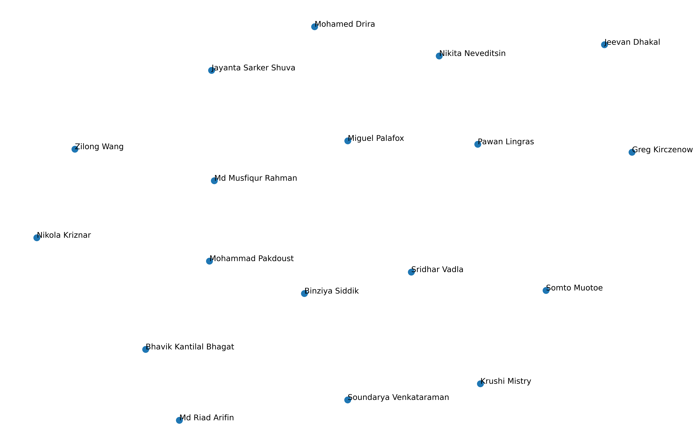

# MCDA5511 - Assignment1 - Sentence Embeddings

This project visualizes the similarity between classmates based on their stated interests using high-dimensional sentence embeddings and UMAP dimensionality reduction.

The application uses the `all-MiniLM-L6-v2` model to generate 384-dimensional embeddings, which are then projected into 2D for interactive or static visualization.

## Generated Visualization



## Project Architecture & Refactoring

The project has been refactored into a modular, professional Python structure to ensure maintainability and testability.

### Key Components:
- **`src/config.py`**: Centralized configuration for all file paths, model names, and visualization settings.
- **`src/utils.py`**: A shared utility hub containing standardized mathematical functions (Cosine Similarity, Spearman Rank Correlation) and common I/O operations for embeddings.
- **`src/data_loader.py`**: Handles CSV parsing and data extraction.
- **`src/embedding_manager.py`**: Manages the loading of SentenceTransformer models and the generation/caching of embeddings.
- **`src/visualizer.py`**: Encapsulates the UMAP reduction and Matplotlib plotting logic.

---

## Directory Structure

```text
.
├── data
│   └── classmates.csv          # Input data
├── output
│   ├── embeddings.json         # Generated embeddings (cached)
│   ├── optimization_history.png # UMAP HPO results
│   ├── umap_hpo_results.csv    # Full HPO trial logs
│   ├── visualization.png       # Final 2D plot
│   └── visualization_seed_*.png # Stability test plots
├── src
│   ├── __init__.py
│   ├── config.py               # Central config
│   ├── data_comparison.py      # Sensitivity analysis script
│   ├── data_loader.py          # Data ingestion
│   ├── embedding_manager.py    # Embedding orchestration
│   ├── main.py                 # Primary entry point
│   ├── model_comparison.py     # Cross-model ranking analysis
│   ├── umap_hpo.py             # Bayesian hyperparameter tuning
│   ├── utils.py                # Shared math/IO utilities
│   └── visualizer.py           # UMAP/Plotting engine
├── pyproject.toml              # Dependencies (uv)
└── uv.lock                     # Lockfile
```

## How to Run

This project uses `uv` for dependency management.

### 1. Initial Setup
```bash
uv sync
```

### 2. Generate Main Visualization
This runs the full pipeline: load data -> generate embeddings -> save -> plot.
```bash
uv run python src/main.py
```

### 3. Run Model Comparison Analysis
Compares rankings between `all-MiniLM-L6-v2` and `all-mpnet-base-v2`.
```bash
uv run python src/model_comparison.py
```

### 4. Run Data Sensitivity Analysis
Measures the impact of minor (synonym) vs. major (antonym) text changes on embedding vectors.
```bash
uv run python src/data_comparison.py
```

### 5. Run UMAP Hyperparameter Optimization (HPO)
Uses Optuna to find the best UMAP parameters for preserving global structure.
```bash
uv run python src/umap_hpo.py
```

---

## What Are Embeddings?
### By: Miguel Angel Palafox Gomez

Mathematical models need numbers to perform calculations, not letters or words. Because of this, words and sentences must be transformed into numerical representations so that algorithms can process them and perform tasks such as clustering, classification, or similarity detection. 

These numerical representations are called embeddings. However, these numbers cannot simply be random. They must preserve meaning so that the relationships between words and sentences are reflected accurately. Embeddings are generated by deep learning models that learn patterns from large amounts of text and assign numbers in a meaningful way. These models learn which words and sentences tend to appear in similar contexts and use that information to create representations that capture meaning.  

A well-known example of word embeddings illustrates how meaning can be preserved through numerical relationships. If we take the embedding for the word “king”, subtract the embedding for “male”, and then add the embedding for “female”, the result is numerically close to the embedding for “queen”. This shows that embeddings capture relationships such as gender and roles, not just the spelling of words. In this way, embeddings allow mathematical models to reason about language in a way that reflects real-world meaning and associations.  

Sentence embeddings work in a similar way but operate on entire sentences rather than individual words. Instead of representing a single word, the model analyzes the overall meaning of a sentence and assigns a numerical representation that reflects its themes and context. For example, a student who writes “I enjoy gaming and playing cricket and volleyball” may be placed near someone who mentions sports or other recreational activities, even if they use different wording. Likewise, someone who says “I like to watch movies, reading detective novels and listening music” might appear close to another student who enjoys reading books, hiking, and watching documentaries because both descriptions reflect leisure activities such as reading and entertainment. Even though the exact words differ, the underlying interests are similar, and embeddings capture that similarity. By converting language into meaningful numerical form, embeddings make it possible for algorithms to compare, group, and visualize text based on meaning rather than exact wording. This allows models to identify patterns and relationships across large collections of text. 

The following figure illustrates a simple three-dimensional example of embeddings. In this illustrative representation, one dimension can be interpreted as a royalty-related attribute, another as a gender-related attribute, and the third as an additional contextual dimension. The embeddings (coordinates) shown are illustrative and were created for explanatory purposes to help visualize how embeddings can represent semantic relationships and analogies, such as how the relationship between king and queen reflects the relationship between male and female.


---

## Data Analysis Experiments

We have conducted three major experiments to validate and optimize our embedding pipeline. Detailed methodology and findings for each are linked below:

### 1. [Data Sensitivity Analysis (Bhavik Bhagat)](SENSITIVITY_ANALYSIS.md)
Measures the impact of minor (synonym) vs. major (antonym) text changes on embedding vectors. 
- **Key Finding**: The model is robust to synonymous rephrasing (similarity > 0.7) but highly sensitive to semantic reversal (~0.56 similarity).

### 2. [Model Comparison Study (Nikola Kriznar)](MODEL_COMPARISON.md)
Compares rankings between `all-MiniLM-L6-v2` and the larger `all-mpnet-base-v2`.
- **Key Finding**: There is a **0.387** Spearman correlation between models, with both agreeing on the top match but diverging on more nuanced relationships.

### 3. [UMAP Hyperparameter Optimization (Sridhar Vadla)](UMAP_HPO.md)
Uses Bayesian Optimization (Optuna) to find the best UMAP settings for 2D visualization.
- **Key Finding**: Optimized for **Manhattan distance** and **12 neighbors**, achieving a preservation score of **0.64** (Trial 62).

---
