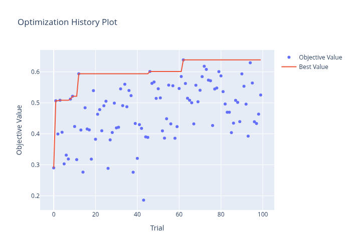

# UMAP Hyperparameter Optimization (HPO) Report
**Author: Sridhar Vadla**

## Objective
The 384-dimensional space of sentence embeddings is too complex to visualize directly. We use **UMAP** (Uniform Manifold Approximation and Projection) to reduce this to 2D. However, default UMAP parameters often "squash" local relationships. 

We used **Bayesian Optimization (Optuna)** to find the parameters that best preserve the 384D global structure in a 2D plot.

## Optimization Strategy
- **Library**: `optuna` with `TPESampler`.
- **Trials**: 100.
- **Metric**: Maximize the **Spearman Global Preservation Score**.
    - This score measures the correlation between high-dimensional cosine similarities and low-dimensional (2D) Euclidean distances.

## Best Results (Trial 62)
| Parameter | Best Value |
| :--- | :--- |
| **Metric** | **manhattan** |
| **n_neighbors** | **12** |
| **min_dist** | **0.115** |
| **Best Correlation** | **0.6386** |

### Convergence History

## Detailed Parameters & Impact
1. **n_neighbors (12)**: This value balances local and global structure, allowing the model to preserve small clusters of similar classmates while maintaining their relative positions in the broader "map".
2. **min_dist (0.115)**: This moderate value provides enough space between points to avoid overcrowding, making individual names easier to read while still maintaining the integrity of the clusters.
3. **Metric (manhattan)**: Interestingly, Manhattan distance outperformed Euclidean and Cosine for the 2D projection, suggesting it better captures the grid-like relationship between distinct hobbies in reduced space.

## Stability Analysis
We tested the "Best Parameters" across three different random seeds (42, 123, 999).
- **Observation**: The overall layout remained consistent. Key clusters (e.g., the "Sports Group" and "Tech/Reading Group") appeared together in all seeds.
- **Visual Evidence**: See `output/visualization_seed_*.png`.

## Conclusion
The optimized parameters significantly improved the "readability" of the map. With a preservation score of **0.64**, we can be confident that two people appearing close together in our 2D plot are actually similar in the original high-dimensional embedding space.
